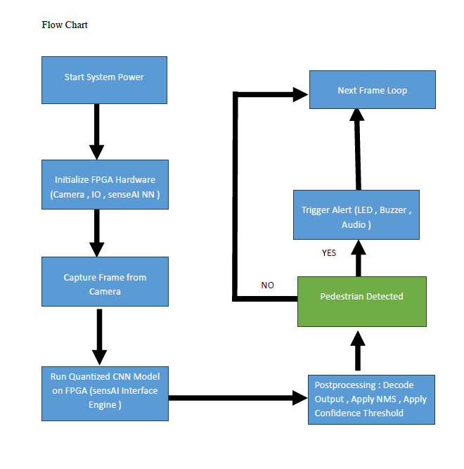
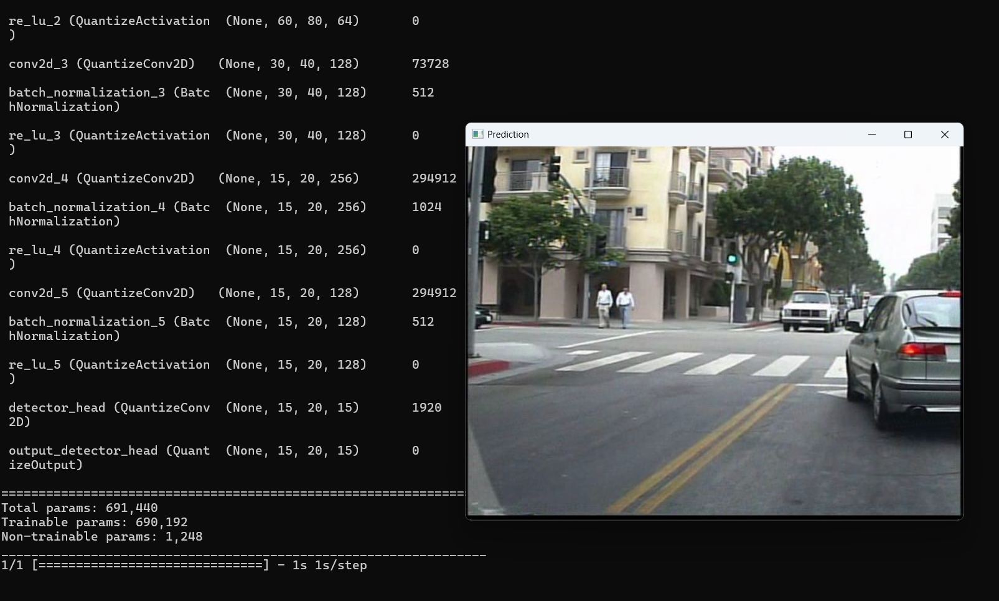
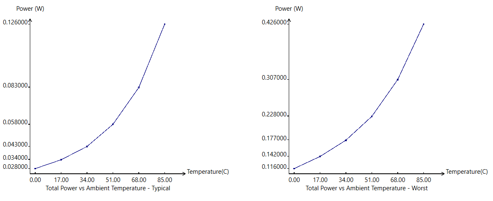
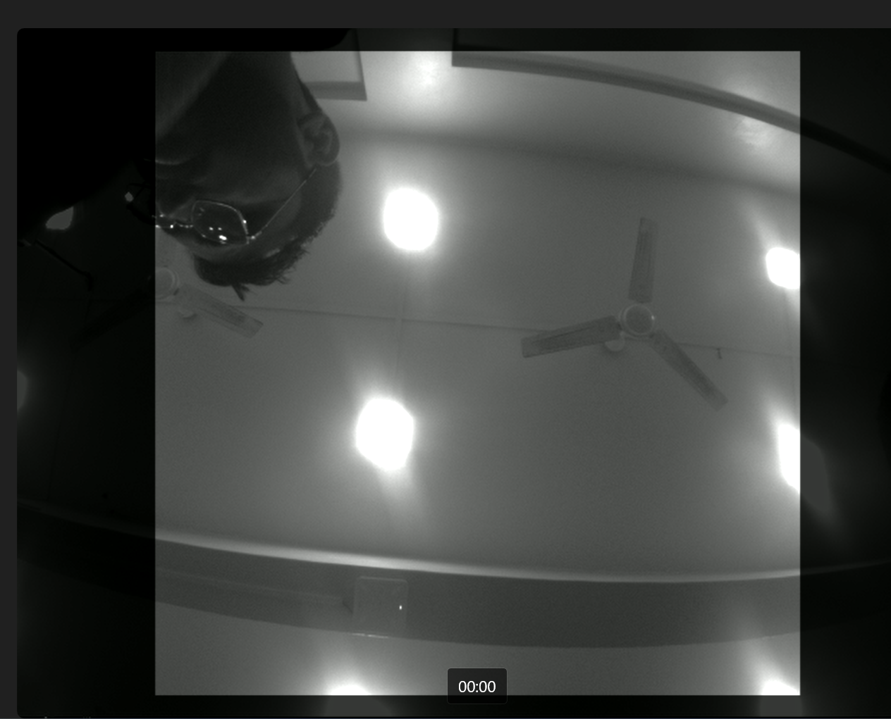

# Pedestrian Detection & Alert System on Lattice CertusPro-NX FPGA

This repository showcases a hardware-accelerated pedestrian detection system implemented on the Lattice CertusPro-NX FPGA platform using machine learning and RTL-based post-processing modules.

---

# 🚀 Project Overview

The project focuses on deploying a lightweight CNN-based pedestrian detection pipeline for edge AI applications with low power consumption and real-time processing capability.

### Key Features

* FPGA-based edge inference pipeline
* CNN model optimized for hardware deployment
* RTL-based bounding box processing
* Real-time video overlay output
* Low-power implementation on Lattice FPGA platform

---

# 🛠️ Tools & Technologies

* TensorFlow
* Lattice sensAI
* Lattice Propel
* Lattice Radiant
* Verilog HDL
* FPGA RTL Design

---

# 🛠️ Toolchain & Development Flow

The project uses the complete Lattice Semiconductor FPGA development flow for model deployment and hardware integration.

```text id="c6k2r1"
[TensorFlow / LATTE] ──> [Lattice sensAI] ──> [Lattice Propel] ──> [Lattice Radiant] ──> [Radiant Programmer]

(Model Training)        (NN Compilation)      (SoC Integration)    (Synthesis & P&R)       (Hardware Flashing)
```

### Flow Overview

* **TensorFlow / LATTE** → CNN model training and dataset preparation
* **Lattice sensAI** → Model optimization and FPGA deployment conversion
* **Lattice Propel** → SoC integration and hardware configuration
* **Lattice Radiant** → Synthesis, place-and-route, and bitstream generation
* **Radiant Programmer** → FPGA flashing and deployment

---

# 📐 System Architecture

The system pipeline includes:

1. Image input stream
2. CNN inference engine
3. RTL post-processing modules
4. Bounding box generation
5. Video overlay output



---

# 🧠 Machine Learning Pipeline

### Dataset

* Caltech Pedestrian Dataset

### Model Details

* Input Resolution: 320×320
* Lightweight CNN architecture
* Hardware-oriented optimization for FPGA deployment



---

# 🔧 RTL Post-Processing Modules

Custom RTL modules were developed for:

* Confidence threshold filtering
* Bounding box coordinate conversion
* Object tracking support
* Video overlay generation

These modules help reduce CPU-side processing and enable real-time hardware execution.

---

# ⚡ Power Analysis

The design targets low-power edge inference suitable for FPGA-based embedded AI systems.

### Power Characteristics

* Optimized for low-power FPGA execution
* Hardware acceleration reduces software processing overhead
* Suitable for edge AI and embedded vision applications



---

# 📊 Hardware Deployment

The design was synthesized and deployed on the Lattice CertusPro-NX FPGA platform using Lattice Radiant tools.

### Results

* Low-power edge inference
* Real-time bounding box visualization
* Hardware-accelerated processing pipeline



---

# 📁 Repository Structure

```text id="j4n9z7"
├── README.md
└── assets/
    ├── block_diagram.png
    ├── inference_result.jpg
    ├── model_training.png
    └── power_analysis.png
```

---

# 🚧 Future Improvements

* Hardware Non-Maximum Suppression (NMS)
* Multi-class object detection
* Improved tracking stability
* Real-time alert generation

---

# 📝 Notes

This repository is intended as a project showcase containing architecture, workflow, and hardware validation outputs. Some proprietary tool-generated files and reference IP components are not included.

---

# 👨‍💻 Author

Parshuram Deshpande
ECE Student | RTL Design | Design Verification | DV Automation | RISC-V
